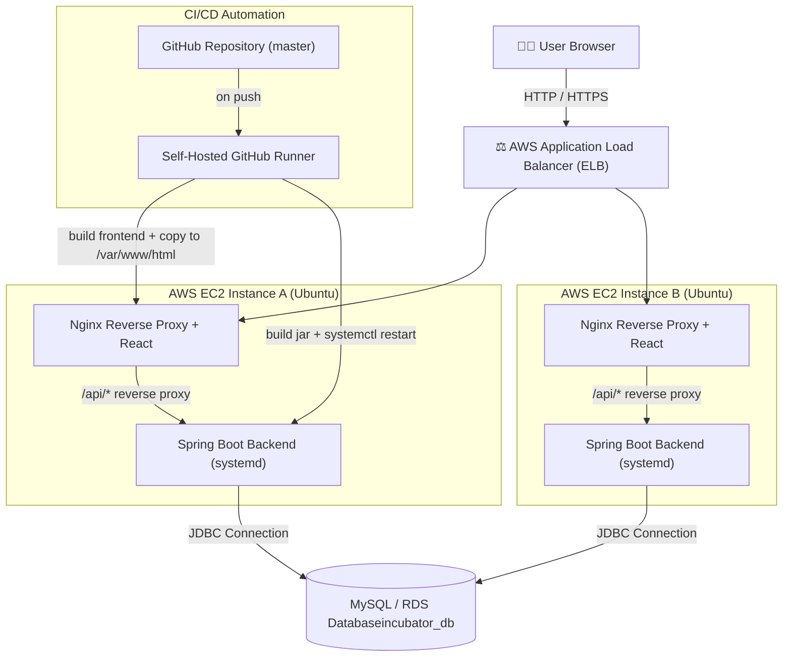

# 🚀 My Incubator — Complete System

**Full-Stack Startup Incubator & Enterprise Ecosystem Management Platform**  
*Built during the Graduate Trainee Engineer (GET) Program at Utopia Industries*

*React (Vite) · Spring Boot · MySQL · AWS EC2 · AWS Application Load Balancer (ALB) · Nginx · GitHub Actions CI/CD*


---

> ⚠️ **Security Note:** Earlier drafts or local test configurations may have contained local database credentials or development endpoints. All sensitive variables have been abstracted and replaced with placeholders below—see [§12 Production Hardening Checklist](#-12-production-hardening-checklist) for proper configuration via server-side `.env` files and GitHub Actions Secrets.

---

## 📑 Table of Contents

1. [Overview & Tech Stack](#-1-overview--tech-stack)
   - [System Architecture (with Load Balancer)](#️-system-architecture-with-load-balancer)
   - [Load Balancer Setup (AWS ALB)](#️-load-balancer-setup-aws-alb)
2. [Role-Based Portals & Workflows](#-2-role-based-portals--workflows)
3. [Backend Setup (Spring Boot & MySQL)](#-3-backend-setup-spring-boot--mysql)
4. [Frontend Setup (React)](#-4-frontend-setup-react)
5. [AWS EC2 Server Preparation](#-5-aws-ec2-server-preparation)
6. [Running the Backend as a systemd Service](#-6-running-the-backend-as-a-systemd-service)
7. [Serving the Frontend via Nginx](#-7-serving-the-frontend-via-nginx)
8. [GitHub Actions Self-Hosted Runner](#-8-github-actions-self-hosted-runner)
9. [CI/CD Pipeline (`deploy.yml`)](#-9-cicd-pipeline-deployyml)
10. [Deploying Changes](#-10-deploying-changes)
11. [Live Application Demos & Repository](#-11-live-application-demos--repository)
12. [Production Hardening Checklist](#-12-production-hardening-checklist)
13. [Project Screenshots](#-13-project-screenshots)

---

## 🧱 1. Overview & Tech Stack

An enterprise-grade platform designed to streamline incubation programs, track mentorship sessions, manage investor pipelines, and monitor startup project milestones from a centralized dashboard.

| Layer | Technology Stack & Tools |
|---|---|
| **Frontend** | React (Vite), JavaScript (ES6+), HTML5, CSS, Axios, React Router |
| **Backend** | Java, Spring Boot, Spring Data JPA, Hibernate, Apache Maven, Spring Security |
| **Database & Security** | MySQL, Spring Security (RBAC Authentication & Authorization) |
| **Infrastructure & DevOps** | AWS EC2 (Ubuntu Server), AWS Application Load Balancer (ALB), Nginx, MobaXterm (SSH/SFTP), GitHub Actions & Self-Hosted Runner (CI/CD), Linux Command Line (`nohup`), Postman |


📁 Project Directory Structure

```text
my-incubator-complete-system/
├── backend/
│   ├── src/main/java/
│   ├── src/main/resources/
│   │   └── application.properties
│   └── pom.xml
├── frontend/
│   ├── src/
│   ├── package.json
│   └── vite.config.js
├── .github/
│   └── workflows/
│       └── deploy.yml
└── README.md
```


### 🏗️ System Architecture (with Load Balancer)



> 📝 Both backend instances point to a **shared** MySQL/RDS database endpoint to ensure absolute data synchronization and consistency across nodes.

### ⚖️ Load Balancer Setup (AWS ALB)

1. **Create a Target Group:** Navigate to the EC2 console → Target Groups → Create Target Group. Select target type `Instances`, protocol `HTTP`, port `80` (Nginx), and register your EC2 deployment instances.
2. **Configure Health Checks:** Set the health check path to `/` (or a dedicated backend health route proxied through Nginx), interval to `30s`, and healthy threshold to `2`.
3. **Create the Application Load Balancer:** Go to Load Balancers → Create Load Balancer (ALB):
   - **Scheme:** Internet-facing
   - **Listeners:** HTTP on port `80` (and HTTPS on `443` if an SSL certificate is attached)
   - **Availability Zones:** Select at least 2 AZs for robust high availability.
   - **Routing:** Forward traffic directly to your configured Target Group.
4. **Security Group Isolation:** Ensure your ALB security group permits inbound traffic on ports `80`/`443` from `0.0.0.0/0`. Lock down individual EC2 instance security groups to accept inbound HTTP traffic **only from the ALB security group**, blocking direct public access.
5. **DNS & Routing:** Point your production domain or DNS records to the AWS ALB DNS name via a CNAME record or Route 53 Alias.
6. **CORS & Origin Handling:** Ensure the Spring Boot backend CORS configuration or `application.properties` accommodates incoming requests originating from the load balancer domain.

---

## 👥 2. Role-Based Portals & Workflows

The platform implements robust Role-Based Access Control (RBAC), dividing operational capabilities into distinct dashboards:
* **Admin Portal:** Full system command and control, user privilege management, system tags configuration, and overall infrastructure oversight.
* **Mentor Portal:** Specialized session scheduling, structural feedback workflows, and guidance tracking for incubation founders.
* **Investor Portal:** Comprehensive portfolio tracking, startup evaluation funnels, and evaluation scorecards.
* **Startup Founder Portal:** Dynamic idea submission pipelines, milestone tracking, resource logs, and direct communication modules.

---

## 🗄️ 3. Backend Setup (Spring Boot & MySQL)

### 3.1 Database Configuration (`application.properties`)

```properties
spring.datasource.url=jdbc:mysql://localhost:3306/incubator_db?useSSL=false&serverTimezone=UTC&allowPublicKeyRetrieval=true
spring.datasource.username=${DB_USERNAME}
spring.datasource.password=${DB_PASSWORD}
spring.jpa.hibernate.ddl-auto=update
spring.jpa.show-sql=true
```

Set local shell environmental variables or a local configuration file:
```bash
export DB_USERNAME=root
export DB_PASSWORD=your_local_password
```

### 3.2 Build & Run Commands
```bash
cd backend
mvn clean install        # Resolve and install dependencies
mvn spring-boot:run      # Launch the embedded Tomcat server
```

---

## ⚛️ 4. Frontend Setup (React)

```bash
cd frontend
npm install              # Install client dependencies
```

| Command | Action |
|---|---|
| `npm run dev` | Run local Vite development server |
| `npm run build` | Generate production build outputs inside `frontend/dist` |

---

## ☁️ 5. AWS EC2 Server Preparation

Connect to your EC2 virtual server via SSH or MobaXterm and execute the setup instructions sequentially:

### 5.1 System Upgrades
```bash
sudo apt update && sudo apt upgrade -y
```

### 5.2 Install Node.js (v20)
```bash
curl -fsSL https://deb.nodesource.com/setup_20.x | sudo -E bash -
sudo apt install -y nodejs
```

### 5.3 Install Nginx Web Server
```bash
sudo apt install nginx -y
sudo systemctl start nginx
sudo systemctl enable nginx
```

### 5.4 Install Java (OpenJDK 17)
```bash
sudo apt update
sudo apt install openjdk-17-jdk -y
java -version
```

### 5.5 Database Setup (MySQL Server)
```bash
sudo apt install mysql-server -y
sudo systemctl start mysql
sudo systemctl enable mysql

# Secure MySQL installation (set root password, remove test databases)
sudo mysql_secure_installation

sudo mysql -u root -p
```

Create the dedicated application database and restricted database user:
```sql
CREATE DATABASE incubator_db;
CREATE USER 'incubator_app'@'%' IDENTIFIED BY 'REPLACE_WITH_STRONG_PASSWORD';
GRANT ALL PRIVILEGES ON incubator_db.* TO 'incubator_app'@'%';
FLUSH PRIVILEGES;
EXIT;
```

---

## ⚙️ 6. Running the Backend as a systemd Service

To ensure automatic restart upon server reboots or crashes, configure a `systemd` service:

### 6.1 Package the Application JAR
```bash
cd backend
mvn clean package -DskipTests
```

### 6.2 Create the Service File
Create `/etc/systemd/system/incubator-backend.service`:

```ini
[Unit]
Description=Enterprise Incubator Backend Service
After=network.target mysql.service

[Service]
User=ubuntu
WorkingDirectory=/home/ubuntu/my-incubator-complete-system/backend
EnvironmentFile=/home/ubuntu/my-incubator-complete-system/backend/.env
ExecStart=/usr/bin/java -jar target/your-backend-app.jar
SuccessExitStatus=143
Restart=always
RestartSec=5

[Install]
WantedBy=multi-user.target
```

### 6.3 Enable and Start Service
```bash
sudo systemctl daemon-reload
sudo systemctl enable incubator-backend
sudo systemctl start incubator-backend

# Verify operational status
sudo systemctl status incubator-backend
journalctl -u incubator-backend -f
```

---

## 🌐 7. Serving the Frontend via Nginx

Deploy compiled frontend assets directly to Nginx's web root:
```bash
sudo cp -r frontend/dist/* /var/www/html/
sudo systemctl restart nginx
```

Configure Nginx to support Single Page Application (SPA) client-side routing fallback:
```nginx
location / {
    try_files $uri /index.html;
}
```

---

## 🏃 8. GitHub Actions Self-Hosted Runner

1. Go to your GitHub Repository: **Settings → Actions → Runners → New self-hosted runner**
2. Choose **Linux** architecture and execute the provided token configuration scripts on your server:

```bash
mkdir actions-runner && cd actions-runner

curl -o actions-runner-linux-x64-2.330.0.tar.gz -L \
  https://github.com/actions/runner/releases/download/v2.330.0/actions-runner-linux-x64-2.330.0.tar.gz

tar xzf ./actions-runner-linux-x64-2.330.0.tar.gz

./config.sh --url https://github.com// --token 
```

3. Install and run as a permanent background service:
```bash
sudo ./svc.sh install
sudo ./svc.sh start
```

---

## 🔄 9. CI/CD Pipeline (`deploy.yml`)

Create `.github/workflows/deploy.yml`:

```yaml
name: Auto Deploy to Ubuntu EC2

on:
  push:
    branches:
      - master

jobs:
  deploy:
    runs-on: self-hosted

    steps:
      - name: Checkout Code
        uses: actions/checkout@v4

      - name: Setup Node.js
        uses: actions/setup-node@v4
        with:
          node-version: 20

      - name: Build Frontend
        working-directory: frontend
        run: |
          npm install
          npm run build

      - name: Deploy Frontend to Nginx
        run: |
          sudo cp -r frontend/dist/* /var/www/html/
          sudo systemctl restart nginx

      - name: Setup Java
        uses: actions/setup-java@v4
        with:
          distribution: temurin
          java-version: '17'

      - name: Build Backend
        working-directory: backend
        run: mvn clean package -DskipTests

      - name: Restart Backend Service
        env:
          DB_USERNAME: ${{ secrets.DB_USERNAME }}
          DB_PASSWORD: ${{ secrets.DB_PASSWORD }}
        run: |
          sudo systemctl restart incubator-backend
```

> 🔐 Secure database credentials (`DB_USERNAME` and `DB_PASSWORD`) under GitHub **Settings → Secrets and variables → Actions**.

---

## 📦 10. Deploying Changes

Push code modifications directly to trigger the automated CI/CD deployment pipeline:
```bash
git add .
git commit -m "feat: updated system modules and configurations"
git push origin master
```

---

## 🔗 11. Live Application Demos & Repository

* **Live Application Demo (AWS Load Balancer ELB):** http://incubaotsystem2-775054819.us-east-1.elb.amazonaws.com/
* **Live Application Demo (Direct IP Node):** http://54.221.77.152/
* **GitHub Repository:** https://lnkd.in/dgmuBCFr

---

## ✅ 12. Production Hardening Checklist

- [ ] All database secrets and API tokens managed via server `.env` or GitHub Secrets.
- [ ] `.env`, build outputs (`target/`, `dist/`), and logs excluded via `.gitignore`.
- [ ] MySQL database user permissions restricted to least-privilege operations.
- [ ] AWS EC2 Security Groups configured to accept web traffic exclusively through the Load Balancer.
- [ ] Spring Boot backend running stably as a managed `systemd` background service.
- [ ] Nginx configured with appropriate reverse proxy endpoints and SSL support.

---

## 🖼️ 13. Project Screenshots


### 🔐 Authentication Views
| Login Interface | Signup Interface |
|:---:|:---:|
|  |  |

### 📊 Dashboard & System Logs
| System Dashboard | System Logs Monitor |
|:---:|:---:|
|  |  |

### 💡 Idea Pipeline & Feedback Modules
| Idea Pipeline Workflow | Feedback Portal |
|:---:|:---:|
|  |  |

### 🤝 Mentors & Investors Directory
| Mentors Directory | Investors Directory |
|:---:|:---:|
|  |  |

### 👥 Community, Finance & Notifications
| Community Feed | Finance Portal | Notifications Center |
|:---:|:---:|:---:|
|  |  |  |

### 🛠️ Management & Interactive Activities
| Manage Tags | Activity & Comments | Additional Capture |
|:---:|:---:|:---:|
|  |  |  |


---


*Engineered with precision during the Graduate Trainee Engineer Program at Utopia Industries.*

#SpringBoot #ReactJS #FullStackDevelopment #DevOps #WebDevelopment #SoftwareEngineering #CloudDeployment #AWS #LoadBalancer #UtopiaIndustries #PakistanEngineeringCouncil
