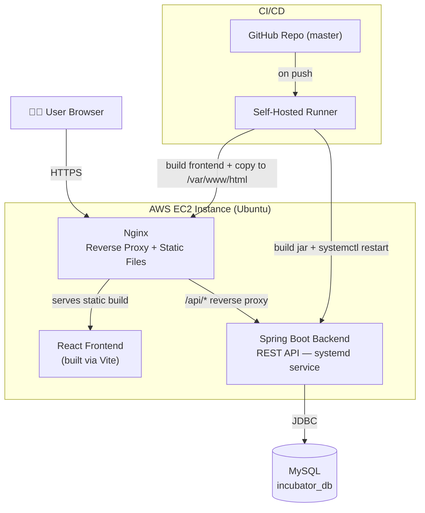
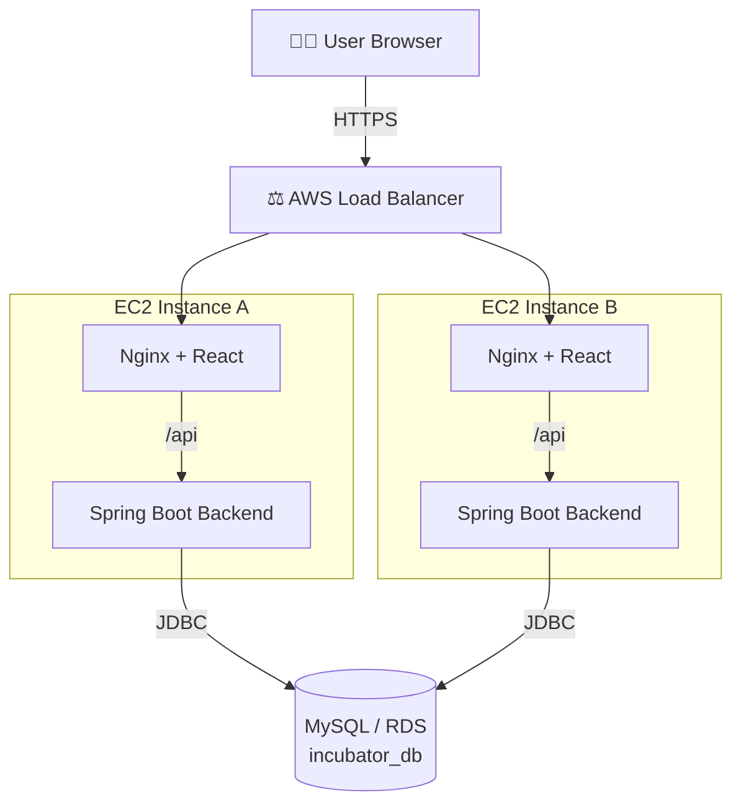

<div align="center">

# 🚀 My Incubator — Complete System

**Full-Stack Startup Incubator Platform**
*React · Spring Boot · MySQL · AWS EC2 · GitHub Actions CI/CD*


</div>

---

> ⚠️ **Security note:** earlier drafts of this document had real database passwords and RDS endpoints hardcoded. All secrets have been replaced with placeholders below — see [§10 Production Hardening](#-10-production-hardening-checklist) for where real values belong (`.env` files, GitHub Actions Secrets). Any credential that was ever committed should be treated as compromised and rotated immediately.

## 📑 Table of Contents

1. [Overview & Tech Stack](#-1-overview--tech-stack)
   - [System Architecture (with Load Balancer)](#️-system-architecture)
   - [Load Balancer Setup (AWS ALB)](#️-load-balancer-setup-aws-alb)
2. [Backend Setup](#-2-backend-setup-spring-boot--mysql)
3. [Frontend Setup](#-3-frontend-setup-react)
4. [AWS EC2 Provisioning](#-4-aws-ec2-server-preparation)
5. [Backend as a systemd Service](#-5-running-the-backend-as-a-service)
6. [Serving Frontend via Nginx](#-6-serving-the-frontend-via-nginx)
7. [Self-Hosted GitHub Runner](#-7-github-actions-self-hosted-runner)
8. [CI/CD Pipeline](#-8-cicd-workflow-deployyml)
9. [Deploying Changes](#-9-deploying-changes)
10. [Production Hardening Checklist](#-10-production-hardening-checklist)
11. [Screenshots](#-11-project-screenshots)

---

## 🧱 1. Overview & Tech Stack

| Layer | Stack |
|---|---|
| **Frontend** | React (Vite), JavaScript, HTML5, CSS, Axios |
| **Backend** | Java, Spring Boot, Spring Data JPA, MySQL |
| **Infrastructure** | AWS EC2 (Ubuntu), Nginx, GitHub Actions (self-hosted runner) |

<details>
<summary><strong>📁 Project Directory Structure</strong></summary>

```text
my-incubator-complete-system/
├── backend/
│   ├── src/main/java/
│   ├── src/main/resources/
│   │   └── application.properties
│   └── pom.xml
├── frontend/
│   ├── src/
│   ├── package.json
│   └── vite.config.js
├── .github/
│   └── workflows/
│       └── deploy.yml
└── README.md
```

</details>

### 🏗️ System Architecture

**Current setup — single EC2 instance:**



**Planned — scaled setup with Load Balancer:**



> 📝 Both backend instances point to a **shared** MySQL/RDS endpoint (not per-instance local MySQL) so data stays consistent across nodes. Add the load balancer's DNS/IP to each Nginx server block and to any CORS-allowed origins in the backend.

### ⚖️ Load Balancer Setup (AWS ALB)

1. **Create a Target Group** — EC2 console → Target Groups → New → target type `Instances`, protocol `HTTP`, port `80` (Nginx). Register each EC2 instance running the app.
2. **Health check** — path `/` (or a dedicated `/health` endpoint on the backend proxied through Nginx), healthy threshold `2`, interval `30s`. The ALB only routes traffic to instances passing this check.
3. **Create the Load Balancer** — EC2 console → Load Balancers → New → Application Load Balancer:
   - Scheme: internet-facing
   - Listeners: `HTTP:80` (and `HTTPS:443` once you attach an ACM certificate)
   - Availability Zones: select at least 2 for redundancy
   - Forward the listener to the Target Group created above
4. **Security groups** — ALB's security group allows inbound `80`/`443` from `0.0.0.0/0`. Each EC2 instance's security group should only allow inbound `80` from the **ALB's security group**, not from the public internet directly.
5. **DNS** — point your domain (Route 53 or external DNS) to the ALB's DNS name via a `CNAME` or an `A` record with Alias (if using Route 53).
6. **CORS / allowed origins** — update `application.properties` (or a `@CrossOrigin` / `WebMvcConfigurer` bean) so the backend accepts requests from the ALB's domain, not `localhost`.
7. **Sticky sessions** — enable if the app relies on server-side session state; skip if it's fully stateless (JWT/stateless REST is preferred for multi-instance setups).

> ⚠️ Without step 4, traffic can bypass the load balancer and hit an EC2 instance directly — always lock instance security groups down to ALB-only traffic once the ALB is live.

---

## 🗄️ 2. Backend Setup (Spring Boot & MySQL)

### 2.1 Database Configuration

**Never commit real credentials.** Keep `application.properties` generic and inject secrets via environment variables (or a gitignored `application-local.properties`).

```properties
spring.datasource.url=jdbc:mysql://localhost:3306/incubator_db
spring.datasource.username=${DB_USERNAME}
spring.datasource.password=${DB_PASSWORD}
spring.jpa.hibernate.ddl-auto=update
spring.jpa.show-sql=true
```

Set the actual values locally (e.g. via a gitignored `.env` file or your shell profile):

```bash
export DB_USERNAME=root
export DB_PASSWORD=your_local_password
```

### 2.2 Build & Run

```bash
cd backend
mvn clean install        # install dependencies
mvn spring-boot:run      # start the app
```

---

## ⚛️ 3. Frontend Setup (React)

```bash
cd frontend
npm install
```

| Command | Purpose |
|---|---|
| `npm run dev` | Start local dev server |
| `npm run build` | Production build → outputs to `frontend/dist` |

---

## ☁️ 4. AWS EC2 Server Preparation

SSH into your EC2 instance, then run the following in order.

### 4.1 System Update
```bash
sudo apt update && sudo apt upgrade -y
```

### 4.2 Node.js (v20)
```bash
curl -fsSL https://deb.nodesource.com/setup_20.x | sudo -E bash -
sudo apt install -y nodejs
```

### 4.3 Nginx
```bash
sudo apt install nginx -y
sudo systemctl start nginx
sudo systemctl enable nginx
```

### 4.4 Java (OpenJDK 17)
```bash
sudo apt update
sudo apt install openjdk-17-jdk -y
java -version
```

### 4.5 MySQL Setup
```bash
sudo apt install mysql-server -y
sudo systemctl start mysql
sudo systemctl enable mysql

# Interactive hardening — strong root password, remove anonymous users/test DB
sudo mysql_secure_installation

sudo mysql -u root -p
```

Create the database and an app-specific user (avoid exposing `root` over the network):

```sql
CREATE DATABASE incubator_db;
CREATE USER 'incubator_app'@'%' IDENTIFIED BY 'REPLACE_WITH_STRONG_PASSWORD';
GRANT ALL PRIVILEGES ON incubator_db.* TO 'incubator_app'@'%';
FLUSH PRIVILEGES;
EXIT;
```

> 💡 Use **one consistent database name** (`incubator_db`) across app config, EC2 setup, and RDS — mismatched names are a common source of "works locally, breaks in prod" bugs.

If remote access is needed (e.g. EC2 → RDS, or dev machine → EC2's MySQL), restrict `bind-address` in `/etc/mysql/mysql.conf.d/mysqld.cnf` to trusted IPs rather than `0.0.0.0`. Restart after any change:

```bash
sudo systemctl restart mysql
```

Then point production config at the live database (prefer environment variables over hardcoding):

```properties
spring.datasource.url=jdbc:mysql://<your-rds-endpoint>:3306/incubator_db?useSSL=true&serverTimezone=UTC&allowPublicKeyRetrieval=true
spring.datasource.username=${DB_USERNAME}
spring.datasource.password=${DB_PASSWORD}
```

Set `DB_USERNAME` / `DB_PASSWORD` as real environment variables on the server, or inject them via GitHub Actions Secrets at deploy time — never in a committed file.

---

## ⚙️ 5. Running the Backend as a Service

`nohup` is fine for a quick test but won't survive a reboot or auto-restart on crash. Use **systemd** for production.

### 5.1 Build the JAR
```bash
cd backend
mvn clean package
```

### 5.2 Create the systemd Unit
`/etc/systemd/system/incubator-backend.service`:

```ini
[Unit]
Description=My Incubator Backend Service
After=network.target mysql.service

[Service]
User=ubuntu
WorkingDirectory=/home/ubuntu/my-incubator-complete-system/backend
EnvironmentFile=/home/ubuntu/my-incubator-complete-system/backend/.env
ExecStart=/usr/bin/java -jar target/your-backend-app.jar
SuccessExitStatus=143
Restart=always
RestartSec=5

[Install]
WantedBy=multi-user.target
```

`EnvironmentFile` points to a gitignored `.env` on the server holding `DB_USERNAME=...` and `DB_PASSWORD=...`.

### 5.3 Enable & Start
```bash
sudo systemctl daemon-reload
sudo systemctl enable incubator-backend
sudo systemctl start incubator-backend

# Check status / logs
sudo systemctl status incubator-backend
journalctl -u incubator-backend -f
```

---

## 🌐 6. Serving the Frontend via Nginx

```bash
sudo cp -r frontend/dist/* /var/www/html/
sudo systemctl restart nginx
```

For SPA routing to survive page refreshes, add a fallback in your Nginx site config:

```nginx
location / {
    try_files $uri /index.html;
}
```

---

## 🏃 7. GitHub Actions Self-Hosted Runner

1. In the repo: **Settings → Actions → Runners → New self-hosted runner**
2. Select **Linux** and run the commands GitHub shows (always copy the token fresh from the UI — it expires):

```bash
mkdir actions-runner && cd actions-runner

curl -o actions-runner-linux-x64-2.330.0.tar.gz -L \
  https://github.com/actions/runner/releases/download/v2.330.0/actions-runner-linux-x64-2.330.0.tar.gz

tar xzf ./actions-runner-linux-x64-2.330.0.tar.gz

./config.sh --url https://github.com/<org>/<repo> --token <TOKEN_FROM_GITHUB_UI>
```

3. Install as a service (survives disconnects and reboots — don't run `./run.sh` in the foreground):

```bash
sudo ./svc.sh install
sudo ./svc.sh start
```

---

## 🔄 8. CI/CD Workflow (`deploy.yml`)

`.github/workflows/deploy.yml`:

```yaml
name: Auto Deploy to Ubuntu EC2

on:
  push:
    branches:
      - master

jobs:
  deploy:
    runs-on: self-hosted

    steps:
      - name: Checkout Code
        uses: actions/checkout@v4

      - name: Setup Node.js
        uses: actions/setup-node@v4
        with:
          node-version: 20

      - name: Build Frontend
        working-directory: frontend
        run: |
          npm install
          npm run build

      - name: Deploy Frontend to Nginx
        run: |
          sudo cp -r frontend/dist/* /var/www/html/
          sudo systemctl restart nginx

      - name: Setup Java
        uses: actions/setup-java@v4
        with:
          distribution: temurin
          java-version: '17'

      - name: Build Backend
        working-directory: backend
        run: mvn clean package -DskipTests

      - name: Restart Backend Service
        env:
          DB_USERNAME: ${{ secrets.DB_USERNAME }}
          DB_PASSWORD: ${{ secrets.DB_PASSWORD }}
        run: |
          sudo systemctl restart incubator-backend
```

> 🔐 Store `DB_USERNAME` and `DB_PASSWORD` under **Settings → Secrets and variables → Actions** — never in the YAML itself. This pipeline rebuilds **and** restarts both frontend and backend on every push to `master`.

---

## 📦 9. Deploying Changes

```bash
git add .
git commit -m "Describe what changed"
git push origin master
```

The self-hosted runner picks up the push, rebuilds both frontend and backend, and restarts services automatically.

---

## ✅ 10. Production Hardening Checklist

- [ ] All secrets (DB credentials, tokens) live in `.env` files or GitHub Secrets — never in tracked files
- [ ] `.env`, `*.log`, and `target/` are in `.gitignore`
- [ ] MySQL `bind-address` restricted to known IPs, not open to the world
- [ ] Database user has least-privilege access (not raw `root` over the network)
- [ ] EC2 security group only opens ports actually used (80/443 web, 22 SSH from your IP, 3306 only if truly needed remotely)
- [ ] HTTPS enabled on Nginx (e.g. via Certbot / Let's Encrypt)
- [ ] Backend runs under `systemd` (not `nohup`) — restarts on crash/reboot
- [ ] Logs rotated (`journalctl` handles this for systemd; set retention limits)
- [ ] Any credential ever committed to the repo has been rotated

---

## 🖼️ 11. Project Screenshots

> Paths are relative to this `README.md`, located in `Frontend/` alongside `Screenshots/` (`Frontend/Screenshots/*.PNG`). Update paths if you relocate the README.

<div align="center">

### 🔐 Login & Signup
| Login | Signup |
|:---:|:---:|
|  |  |

### 📊 Dashboard & System Logs
| Dashboard | System Logs |
|:---:|:---:|
|  |  |

### 💡 Idea Pipeline & Feedback
| Idea Pipeline | Feedback |
|:---:|:---:|
|  |  |

### 🤝 Mentors & Investors Directory
| Mentors | Investors |
|:---:|:---:|
|  |  |

### 👥 Community, Finance & Notifications
| Community | Finance | Notifications |
|:---:|:---:|:---:|
|  |  |  |

### 🛠️ Management & Activities
| Manage Tags | Activity / Comments | Additional Capture |
|:---:|:---:|:---:|
|  |  |  |

</div>

---

<div align="center">

*Built with ☕ and late-night deploys.*

</div>
