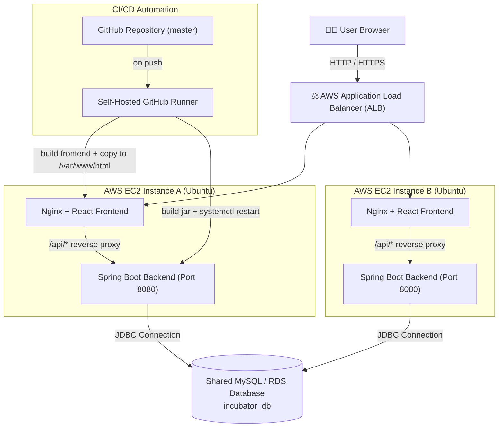

<div align="center">

# 🚀 My Incubator — Complete System

**Full-Stack Startup Incubator & Enterprise Ecosystem Management Platform**
*Built during the Graduate Trainee Engineer (GET) Program at Utopia Industries*

*React (Vite) · Spring Boot · MySQL · AWS EC2 · AWS Application Load Balancer (ALB) · Nginx · MobaXterm · GitHub Actions CI/CD*


</div>

---

> ⚠️ **Security Note:** All sensitive credentials, tokens, and database passwords have been abstracted and replaced with placeholders. Refer to [§13 Production Hardening Checklist](#-13-production-hardening-checklist) for proper configuration using server-side `.env` files and GitHub Actions Secrets.

---

## 📑 Table of Contents

1. [Overview & Tech Stack](#-1-overview--tech-stack)
   - [System Architecture & Multi-Instance Load Balancer Setup](#️-system-architecture--multi-instance-load-balancer-setup)
2. [Role-Based Portals & Workflows](#-2-role-based-portals--workflows)
3. [Local Development Setup](#-3-local-development-setup)
4. [Step-by-Step AWS EC2 Provisioning via MobaXterm](#-4-step-by-step-aws-ec2-provisioning-via-mobaxterm)
5. [Deploying Frontend & Backend on Instance A](#-5-deploying-frontend--backend-on-instance-a)
6. [Scaling Up: Launching Instance B & Configuring AWS Load Balancer (ALB)](#-6-scaling-up-launching-instance-b--configuring-aws-load-balancer-alb)
7. [Running the Backend as a systemd Service (Auto-Restart)](#-7-running-the-backend-as-a-systemd-service-auto-restart)
8. [Serving the Frontend via Nginx & SPA Routing](#-8-serving-the-frontend-via-nginx--spa-routing)
9. [GitHub Actions Self-Hosted Runner Setup](#-9-github-actions-self-hosted-runner-setup)
10. [CI/CD Automated Deployment Pipeline (`deploy.yml`)](#-10-cicd-automated-deployment-pipeline-deployyml)
11. [Deploying Code Changes](#-11-deploying-code-changes)
12. [Live Application Demos & Repository](#-12-live-application-demos--repository)
13. [Production Hardening Checklist](#-13-production-hardening-checklist)
14. [Project Screenshots](#-14-project-screenshots)

---

## 🧱 1. Overview & Tech Stack

An enterprise-grade platform designed to streamline incubation programs, track mentorship sessions, manage investor pipelines, and monitor startup project milestones from a centralized dashboard.

| Layer | Technology Stack & Tools |
|---|---|
| **Frontend** | React (Vite), JavaScript (ES6+), HTML5, CSS, Axios, React Router |
| **Backend** | Java, Spring Boot, Spring Data JPA, Hibernate, Apache Maven, Spring Security |
| **Database & Security** | MySQL, Spring Security (RBAC Authentication & Authorization) |
| **Infrastructure & DevOps** | AWS EC2 (Ubuntu Server Multi-Instance), AWS Application Load Balancer (ALB), Nginx, MobaXterm (SSH/SFTP), GitHub Actions & Self-Hosted Runner (CI/CD), Linux Command Line (`nohup`, `systemd`), Postman |

<details>
<summary><strong>📁 Project Directory Structure</strong></summary>

```text
my-incubator-complete-system/
├── backend/
│   ├── src/main/java/
│   ├── src/main/resources/
│   │   └── application.properties
│   └── pom.xml
├── frontend/
│   ├── src/
│   ├── package.json
│   └── vite.config.js
├── Screenshots/
│   └── (Project UI PNGs)
├── .github/
│   └── workflows/
│       └── deploy.yml
└── README.md
```

</details>

### 🏗️ System Architecture & Multi-Instance Load Balancer Setup



📝 Both backend instances point to a shared MySQL or RDS database endpoint to ensure absolute data synchronization and consistency across nodes.

---

## 👥 2. Role-Based Portals & Workflows

The platform implements robust Role-Based Access Control (RBAC), dividing operational capabilities into distinct dashboards:

- **Admin Portal** — Full system command and control, user privilege management, system tags configuration, and overall infrastructure oversight.
- **Mentor Portal** — Specialized session scheduling, structural feedback workflows, and guidance tracking for incubation founders.
- **Investor Portal** — Comprehensive portfolio tracking, startup evaluation funnels, and evaluation scorecards.
- **Startup Founder Portal** — Dynamic idea submission pipelines, milestone tracking, resource logs, and direct communication modules.

---

## 💻 3. Local Development Setup

**Prerequisites**

- Java JDK 17+
- Node.js & npm
- MySQL Server
- Apache Maven

**Backend Configuration (`application.properties`)**

```properties
spring.datasource.url=jdbc:mysql://localhost:3306/incubator_db?useSSL=false&serverTimezone=UTC&allowPublicKeyRetrieval=true
spring.datasource.username=${DB_USERNAME}
spring.datasource.password=${DB_PASSWORD}
spring.jpa.hibernate.ddl-auto=update
spring.jpa.show-sql=true
```

**Run backend locally:**

```bash
cd backend
mvn clean install
mvn spring-boot:run
```

**Run frontend locally:**

```bash
cd frontend
npm install
npm run dev
```

---

## ☁️ 4. Step-by-Step AWS EC2 Provisioning via MobaXterm

1. Open MobaXterm, click **Session → SSH**.
2. Enter your AWS EC2 Public IP (e.g., `54.221.77.152`), specify username `ubuntu`, and load your private `.pem` SSH key file under Advanced SSH settings. Click **OK** to connect.
3. Execute the following commands line by line in your terminal to prepare the Ubuntu server environment:

```bash
# 1. Update system packages
sudo apt update && sudo apt upgrade -y

# 2. Install Node.js (v20) for Frontend compilation
curl -fsSL https://deb.nodesource.com/setup_20.x | sudo -E bash -
sudo apt install -y nodejs

# 3. Install Nginx Web Server
sudo apt install nginx -y
sudo systemctl start nginx
sudo systemctl enable nginx

# 4. Install OpenJDK 17 for Spring Boot Backend
sudo apt update
sudo apt install openjdk-17-jdk -y
java -version

# 5. Install MySQL Database Server (for standalone testing or primary DB node)
sudo apt install mysql-server -y
sudo systemctl start mysql
sudo systemctl enable mysql

# Secure MySQL installation
sudo mysql_secure_installation
```

4. Create the application database and user inside MySQL:

```bash
sudo mysql -u root -p
```

```sql
CREATE DATABASE incubator_db;
CREATE USER 'incubator_app'@'%' IDENTIFIED BY 'StrongPassword123!';
GRANT ALL PRIVILEGES ON incubator_db.* TO 'incubator_app'@'%';
FLUSH PRIVILEGES;
EXIT;
```

---

## 🚀 5. Deploying Frontend & Backend on Instance A

**Clone your repository onto Instance A via MobaXterm terminal:**

```bash
git clone https://lnkd.in/dgmuBCFr
cd my-incubator-complete-system
```

**Build Frontend:**

```bash
cd frontend
npm install
npm run build
sudo cp -r dist/* /var/www/html/
sudo systemctl restart nginx
```

**Configure Nginx Reverse Proxy for Backend API:**

Edit your Nginx configuration (`sudo nano /etc/nginx/sites-available/default`) to proxy API calls to the Spring Boot backend running on port 8080:

```nginx
server {
    listen 80;
    server_name _;

    root /var/www/html;
    index index.html index.htm;

    location / {
        try_files $uri $uri/ /index.html;
    }

    location /api/ {
        proxy_pass http://localhost:8080/;
        proxy_set_header Host $host;
        proxy_set_header X-Real-IP $remote_addr;
        proxy_set_header X-Forwarded-For $proxy_add_x_forwarded_for;
        proxy_set_header X-Forwarded-Proto $scheme;
    }
}
```

**Test and reload Nginx:**

```bash
sudo nginx -t
sudo systemctl reload nginx
```

**Build & Run Backend on Instance A:**

Create a `.env` file inside your `backend/` directory:

```bash
nano backend/.env
```

Add environment variables:

```env
DB_USERNAME=incubator_app
DB_PASSWORD=StrongPassword123!
```

Build the backend JAR package:

```bash
cd backend
mvn clean package -DskipTests
```

Run temporarily using `nohup` or set up as a systemd service (see Section 7):

```bash
nohup java -jar target/*.jar > app.log 2>&1 &
```

---

## ⚖️ 6. Scaling Up: Launching Instance B & Configuring AWS Load Balancer (ALB)

To build a high-availability architecture, we replicate Instance A and route traffic using an AWS Load Balancer:

1. **Launch Instance B** — Go to the AWS EC2 Console, select your configured Instance A, click **Actions → Image and templates → Launch more like this** (or launch a new Ubuntu EC2 instance) and clone the environment (Node, Java, Nginx, repository setup).

2. **Configure Shared Database** — Ensure both Instance A and Instance B point their backend `application.properties` to the same centralized MySQL/RDS database endpoint (`incubator_db`).

3. **Create a Target Group:**
   - Go to **EC2 Console → Target Groups → Create Target Group**.
   - Choose target type: `Instances`, protocol: `HTTP`, port: `80`.
   - Register both Instance A and Instance B to this Target Group.
   - Set health check path to `/` or `/api/health`.

4. **Create the Application Load Balancer (ALB):**
   - Go to **Load Balancers → Create Load Balancer → Application Load Balancer**.
   - Scheme: `Internet-facing`, Listeners: `HTTP` on port `80`.
   - Select your Availability Zones and assign your created Target Group.

5. **Security Group Lockdown:**
   - Configure your ALB security group to allow inbound traffic on port `80/443` from `0.0.0.0/0`.
   - Lock down Instance A and Instance B security groups so they accept inbound HTTP traffic strictly from the ALB's Security Group ID, blocking direct external IP access.

---

## ⚙️ 7. Running the Backend as a systemd Service (Auto-Restart)

To ensure the Spring Boot backend automatically starts on system boot and restarts if it crashes, create a systemd service file on your EC2 instances:

```bash
sudo nano /etc/systemd/system/incubator-backend.service
```

Paste the following configuration:

```ini
[Unit]
Description=Enterprise Incubator Backend Service
After=network.target mysql.service

[Service]
User=ubuntu
WorkingDirectory=/home/ubuntu/my-incubator-complete-system/backend
EnvironmentFile=/home/ubuntu/my-incubator-complete-system/backend/.env
ExecStart=/usr/bin/java -jar target/your-backend-app.jar
SuccessExitStatus=143
Restart=always
RestartSec=5

[Install]
WantedBy=multi-user.target
```

Enable and start the service:

```bash
sudo systemctl daemon-reload
sudo systemctl enable incubator-backend
sudo systemctl start incubator-backend

# Check live logs
sudo systemctl status incubator-backend
journalctl -u incubator-backend -f
```

---

## 🌐 8. Serving the Frontend via Nginx & SPA Routing

Manual deployment of compiled frontend static assets:

```bash
cd frontend
npm run build
sudo cp -r dist/* /var/www/html/
sudo systemctl restart nginx
```

Ensure client-side routing fallback is enabled in your Nginx server block:

```nginx
location / {
    try_files $uri $uri/ /index.html;
}
```

---

## 🏃 9. GitHub Actions Self-Hosted Runner Setup

To automate deployments directly from GitHub pushes to your EC2 instance:

1. Navigate to your GitHub Repository: **Settings → Actions → Runners → New self-hosted runner**.
2. Select **Linux** and run the provided commands line by line in your MobaXterm terminal:

```bash
mkdir actions-runner && cd actions-runner

curl -o actions-runner-linux-x64-2.330.0.tar.gz -L \
  https://github.com/actions/runner/releases/download/v2.330.0/actions-runner-linux-x64-2.330.0.tar.gz

tar xzf ./actions-runner-linux-x64-2.330.0.tar.gz

./config.sh --url https://github.com/your-username/incubator-system --token YOUR_GITHUB_TOKEN
```

3. Install and run the runner as a permanent background service:

```bash
sudo ./svc.sh install
sudo ./svc.sh start
```

---

## 🔄 10. CI/CD Automated Deployment Pipeline (`deploy.yml`)

Create `.github/workflows/deploy.yml` in your repository:

```yaml
name: Auto Deploy to Ubuntu EC2

on:
  push:
    branches:
      - master

jobs:
  deploy:
    runs-on: self-hosted

    steps:
      - name: Checkout Code
        uses: actions/checkout@v4

      - name: Setup Node.js
        uses: actions/setup-node@v4
        with:
          node-version: 20

      - name: Build Frontend
        working-directory: frontend
        run: |
          npm install
          npm run build

      - name: Deploy Frontend to Nginx
        run: |
          sudo cp -r frontend/dist/* /var/www/html/
          sudo systemctl restart nginx

      - name: Setup Java
        uses: actions/setup-java@v4
        with:
          distribution: temurin
          java-version: '17'

      - name: Build Backend
        working-directory: backend
        run: mvn clean package -DskipTests

      - name: Restart Backend Service
        env:
          DB_USERNAME: ${{ secrets.DB_USERNAME }}
          DB_PASSWORD: ${{ secrets.DB_PASSWORD }}
        run: |
          sudo systemctl restart incubator-backend
```

🔐 Store your database credentials securely under **GitHub Settings → Secrets and variables → Actions** as `DB_USERNAME` and `DB_PASSWORD`.

---

## 📦 11. Deploying Code Changes

Whenever you push modifications to your repository `master` branch, the self-hosted runner automatically builds and deploys both frontend and backend:

```bash
git add .
git commit -m "feat: updated system architecture and UI components"
git push origin master
```

---

## 🔗 12. Live Application Demos & Repository

- **Live Application Demo (AWS Load Balancer ELB DNS):** http://incubaotsystem2-775054819.us-east-1.elb.amazonaws.com/
- **Live Application Demo (Direct EC2 IP Node):** http://54.221.77.152/
- **GitHub Repository:** https://lnkd.in/dgmuBCFr

---

## ✅ 13. Production Hardening Checklist

- [ ] All database secrets and API tokens managed via server `.env` files or GitHub Actions Secrets.
- [ ] `.env`, build artifacts (`target/`, `dist/`), and server logs excluded via `.gitignore`.
- [ ] MySQL database user permissions restricted to least-privilege operations.
- [ ] AWS EC2 Security Groups locked down to accept web traffic exclusively through the Application Load Balancer.
- [ ] Spring Boot backend configured to run stably as a managed systemd service with automatic restarts.
- [ ] Nginx configured with appropriate reverse proxy endpoints and SPA fallback rules.

---

## 🖼️ 14. Project Screenshots

### 🔐 Authentication Views

| Login Interface | Signup Interface |
|---|---|
|  |  |

### 📊 Dashboard & System Logs

| System Dashboard | System Logs Monitor |
|---|---|
|  |  |

### 💡 Idea Pipeline & Feedback Modules

| Idea Pipeline Workflow | Feedback Portal |
|---|---|
|  |  |

### 🤝 Mentors & Investors Directory

| Mentors Directory | Investors Directory |
|---|---|
|  |  |

### 👥 Community, Finance & Notifications

| Community Feed | Finance Portal | Notifications Center |
|---|---|---|
|  |  |  |

### 🛠️ Management & Interactive Activities

| Manage Tags | Activity & Comments | Additional Capture |
|---|---|---|
|  |  |  |

---

<div align="center">

*Engineered with precision during the Graduate Trainee Engineer Program at Utopia Industries.*

`#SpringBoot` `#ReactJS` `#FullStackDevelopment` `#DevOps` `#WebDevelopment` `#SoftwareEngineering` `#CloudDeployment` `#AWS` `#LoadBalancer` `#UtopiaIndustries` `#PakistanEngineeringCouncil`

</div>
