# My Incubator Complete System — Full Stack & Automated Deployment Guide

A complete reference for the architecture, local development setup, AWS server provisioning, and GitHub Actions CI/CD pipeline for this project.

> ⚠️ **Security note before you start:** the original draft of this document had real database passwords and RDS endpoints written directly into it. That's a serious risk if this file ever lands in a public repo or is shared with anyone outside the team — it becomes a leaked credential. This revision replaces every secret with a placeholder and shows you where to store the real values instead (`.env` files that are gitignored, or GitHub Actions Secrets). Rotate the password `1430Angsahib` and the root password `123` if they were ever committed anywhere, since they should now be treated as compromised.

---

## Table of Contents

1. [Project Overview & Tech Stack](#1-project-overview--tech-stack)
2. [Backend Setup (Spring Boot & MySQL)](#2-backend-setup-spring-boot--mysql)
3. [Frontend Setup (React)](#3-frontend-setup-react)
4. [AWS EC2 Server Preparation](#4-aws-ec2-server-preparation)
5. [Running the Backend as a Service](#5-running-the-backend-as-a-service)
6. [Serving the Frontend via Nginx](#6-serving-the-frontend-via-nginx)
7. [GitHub Actions Self-Hosted Runner](#7-github-actions-self-hosted-runner)
8. [CI/CD Workflow (deploy.yml)](#8-cicd-workflow-deployyml)
9. [Deploying Changes](#9-deploying-changes)
10. [Production Hardening Checklist](#10-production-hardening-checklist)
11. [Project Screenshots](#11-project-screenshots)

---

## 1. Project Overview & Tech Stack

| Layer | Stack |
|---|---|
| Frontend | React (Vite), JavaScript, HTML5, CSS, Axios |
| Backend | Java, Spring Boot, Spring Data JPA, MySQL |
| Infrastructure | AWS EC2 (Ubuntu), Nginx, GitHub Actions (self-hosted runner) |

### Project Directory Structure

```text
my-incubator-complete-system/
├── backend/
│   ├── src/main/java/
│   ├── src/main/resources/
│   │   └── application.properties
│   └── pom.xml
├── frontend/
│   ├── src/
│   ├── package.json
│   └── vite.config.js
├── .github/
│   └── workflows/
│       └── deploy.yml
└── README.md
```

---

## 2. Backend Setup (Spring Boot & MySQL)

### 2.1 Database Configuration

**Don't commit real credentials.** Use environment variables and keep `application.properties` generic, or use `application-local.properties` (gitignored) for local secrets.

```properties
spring.datasource.url=jdbc:mysql://localhost:3306/incubator_db
spring.datasource.username=${DB_USERNAME}
spring.datasource.password=${DB_PASSWORD}
spring.jpa.hibernate.ddl-auto=update
spring.jpa.show-sql=true
```

Set the actual values as environment variables before running the app, e.g. in a local `.env` file (gitignored) or your shell profile:

```bash
export DB_USERNAME=root
export DB_PASSWORD=your_local_password
```

### 2.2 Build & Run

```bash
cd backend

# Clean and install dependencies via Maven
mvn clean install

# Run the Spring Boot application
mvn spring-boot:run
```

---

## 3. Frontend Setup (React)

### 3.1 Install Dependencies

```bash
cd frontend
npm install
```

### 3.2 Local Development & Production Build

```bash
# Start the local dev server
npm run dev

# Generate a production build (outputs to frontend/dist)
npm run build
```

---

## 4. AWS EC2 Server Preparation

Connect to the EC2 instance via SSH, then run the following in order.

### 4.1 System Update

```bash
sudo apt update && sudo apt upgrade -y
```

### 4.2 Node.js (v20)

```bash
curl -fsSL https://deb.nodesource.com/setup_20.x | sudo -E bash -
sudo apt install -y nodejs
```

### 4.3 Nginx

```bash
sudo apt install nginx -y
sudo systemctl start nginx
sudo systemctl enable nginx
```

### 4.4 Java (OpenJDK 17)

```bash
sudo apt update
sudo apt install openjdk-17-jdk -y
java -version
```

### 4.5 MySQL Setup

```bash
sudo apt install mysql-server -y
sudo systemctl start mysql
sudo systemctl enable mysql

# Interactive hardening — set a strong root password, remove anonymous users/test DB
sudo mysql_secure_installation

sudo mysql -u root -p
```

Inside the MySQL shell, create the database and an application-specific user (avoid granting broad privileges to `root` over the network):

```sql
CREATE DATABASE incubator_db;
CREATE USER 'incubator_app'@'%' IDENTIFIED BY 'REPLACE_WITH_STRONG_PASSWORD';
GRANT ALL PRIVILEGES ON incubator_db.* TO 'incubator_app'@'%';
FLUSH PRIVILEGES;
EXIT;
```

> The original draft created `startup_db` but granted privileges on `incubator_db` — pick one database name and use it consistently everywhere (app config, EC2 setup, RDS). This guide uses `incubator_db` throughout.

If you need remote access (e.g. from EC2 to an RDS instance, or dev machine to EC2's MySQL), check `bind-address` in `/etc/mysql/mysql.conf.d/mysqld.cnf` and restrict it to trusted IPs rather than opening it to `0.0.0.0` where avoidable. Restart after any change:

```bash
sudo systemctl restart mysql
```

Then update `backend/src/main/resources/application.properties` (or better, your environment variables) for the live database:

```properties
spring.datasource.url=jdbc:mysql://<your-rds-endpoint>:3306/incubator_db?useSSL=true&serverTimezone=UTC&allowPublicKeyRetrieval=true
spring.datasource.username=${DB_USERNAME}
spring.datasource.password=${DB_PASSWORD}
```

Set `DB_USERNAME` / `DB_PASSWORD` as real environment variables on the server (or GitHub Actions secrets injected at deploy time) — never hardcode them in a file that gets committed.

---

## 5. Running the Backend as a Service

`nohup` works for a quick test, but it won't survive a server reboot and gives you no automatic restart on crash. A `systemd` service is the more robust option for production.

### 5.1 Build the JAR

```bash
cd backend
mvn clean package
```

### 5.2 Create a systemd Unit

Create `/etc/systemd/system/incubator-backend.service`:

```ini
[Unit]
Description=My Incubator Backend Service
After=network.target mysql.service

[Service]
User=ubuntu
WorkingDirectory=/home/ubuntu/my-incubator-complete-system/backend
EnvironmentFile=/home/ubuntu/my-incubator-complete-system/backend/.env
ExecStart=/usr/bin/java -jar target/your-backend-app.jar
SuccessExitStatus=143
Restart=always
RestartSec=5

[Install]
WantedBy=multi-user.target
```

`EnvironmentFile` points to a gitignored `.env` file on the server containing `DB_USERNAME=...` and `DB_PASSWORD=...`.

### 5.3 Enable & Start

```bash
sudo systemctl daemon-reload
sudo systemctl enable incubator-backend
sudo systemctl start incubator-backend

# Check status / logs
sudo systemctl status incubator-backend
journalctl -u incubator-backend -f
```

---

## 6. Serving the Frontend via Nginx

```bash
sudo cp -r frontend/dist/* /var/www/html/
sudo systemctl restart nginx
```

For a single-page app, add a fallback route in your Nginx site config so client-side routing works on refresh:

```nginx
location / {
    try_files $uri /index.html;
}
```

---

## 7. GitHub Actions Self-Hosted Runner

1. In the GitHub repo: **Settings → Actions → Runners → New self-hosted runner**.
2. Select **Linux**, and run the commands GitHub shows you (they include a per-runner token — always copy it fresh from the GitHub UI rather than reusing an old one, since tokens expire):

```bash
mkdir actions-runner && cd actions-runner

curl -o actions-runner-linux-x64-2.330.0.tar.gz -L \
  https://github.com/actions/runner/releases/download/v2.330.0/actions-runner-linux-x64-2.330.0.tar.gz

tar xzf ./actions-runner-linux-x64-2.330.0.tar.gz

./config.sh --url https://github.com/<org>/<repo> --token <TOKEN_FROM_GITHUB_UI>
```

Instead of running `./run.sh` in a foreground terminal (which dies when you disconnect), install it as a service so it survives reboots:

```bash
sudo ./svc.sh install
sudo ./svc.sh start
```

---

## 8. CI/CD Workflow (deploy.yml)

`.github/workflows/deploy.yml`:

```yaml
name: Auto Deploy to Ubuntu EC2

on:
  push:
    branches:
      - master

jobs:
  deploy:
    runs-on: self-hosted

    steps:
      - name: Checkout Code
        uses: actions/checkout@v4

      - name: Setup Node.js
        uses: actions/setup-node@v4
        with:
          node-version: 20

      - name: Build Frontend
        working-directory: frontend
        run: |
          npm install
          npm run build

      - name: Deploy Frontend to Nginx
        run: |
          sudo cp -r frontend/dist/* /var/www/html/
          sudo systemctl restart nginx

      - name: Setup Java
        uses: actions/setup-java@v4
        with:
          distribution: temurin
          java-version: '17'

      - name: Build Backend
        working-directory: backend
        run: mvn clean package -DskipTests

      - name: Restart Backend Service
        env:
          DB_USERNAME: ${{ secrets.DB_USERNAME }}
          DB_PASSWORD: ${{ secrets.DB_PASSWORD }}
        run: |
          sudo systemctl restart incubator-backend
```

Store `DB_USERNAME` and `DB_PASSWORD` under **Settings → Secrets and variables → Actions** in the repo, not in the YAML itself. This also removes the manual "build frontend only" gap in the original workflow — the backend is now rebuilt and restarted on every push too.

---

## 9. Deploying Changes

```bash
git add .
git commit -m "Describe what changed"
git push origin master
```

The self-hosted runner picks up the push, rebuilds both frontend and backend, and restarts the services automatically.

---

## 10. Production Hardening Checklist

- [ ] All secrets (DB credentials, tokens) live in `.env` files or GitHub Secrets — never in tracked files.
- [ ] `.env`, `*.log`, and `target/` are in `.gitignore`.
- [ ] MySQL `bind-address` is restricted to known IPs, not open to the world.
- [ ] Database user has only the privileges it needs (not raw `root` over the network).
- [ ] EC2 security group only opens the ports you actually use (80/443 for web, 22 for SSH from your IP, 3306 only if truly needed remotely).
- [ ] HTTPS is enabled on Nginx (e.g. via Certbot / Let's Encrypt) rather than serving plain HTTP.
- [ ] Backend runs under systemd (not `nohup`) so it restarts on crash or reboot.
- [ ] Logs are rotated (`journalctl` handles this for systemd services; set retention limits).
- [ ] Rotate any credential that was ever committed to the repo, even if the repo is private.

---

## 11. Project Screenshots

Paths below are relative to this `README.md`, which sits inside `Frontend/` alongside the `Screenshots/` folder (`Frontend/Screenshots/*.PNG`). If you move the README, update these paths accordingly.

### Login & Signup

| Login | Signup |
|---|---|
| 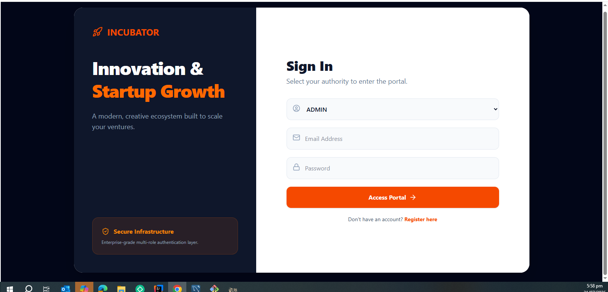 | 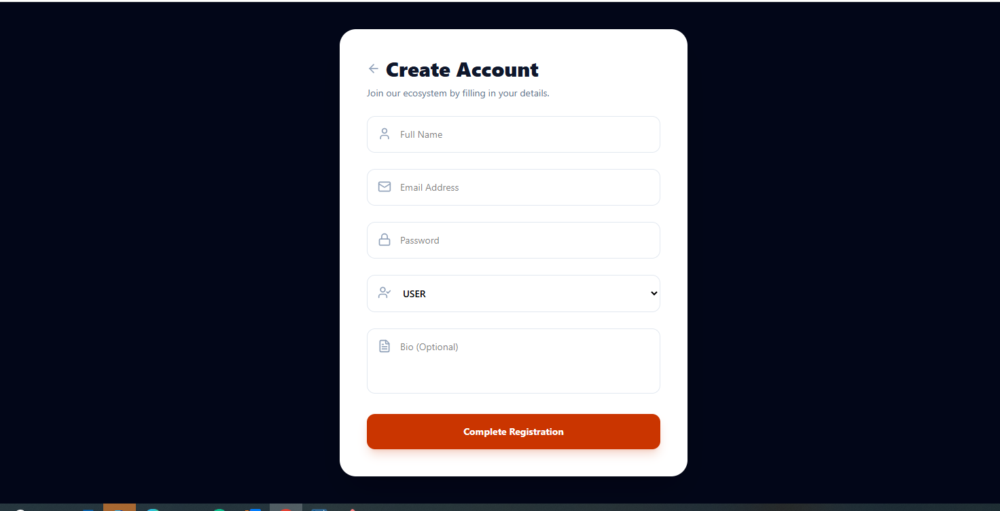 |

### Dashboard & System Logs

| Dashboard | System Logs |
|---|---|
| 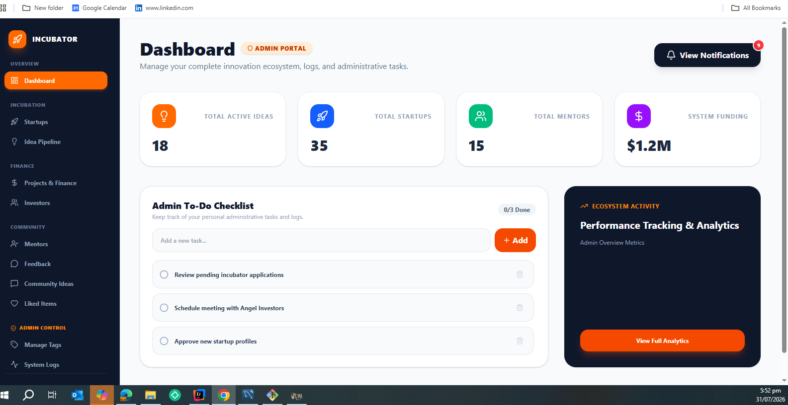 | 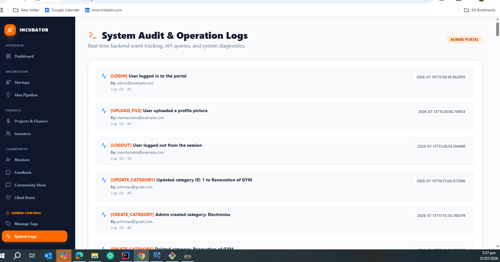 |

### Idea Pipeline & Feedback

| Idea Pipeline | Feedback |
|---|---|
| 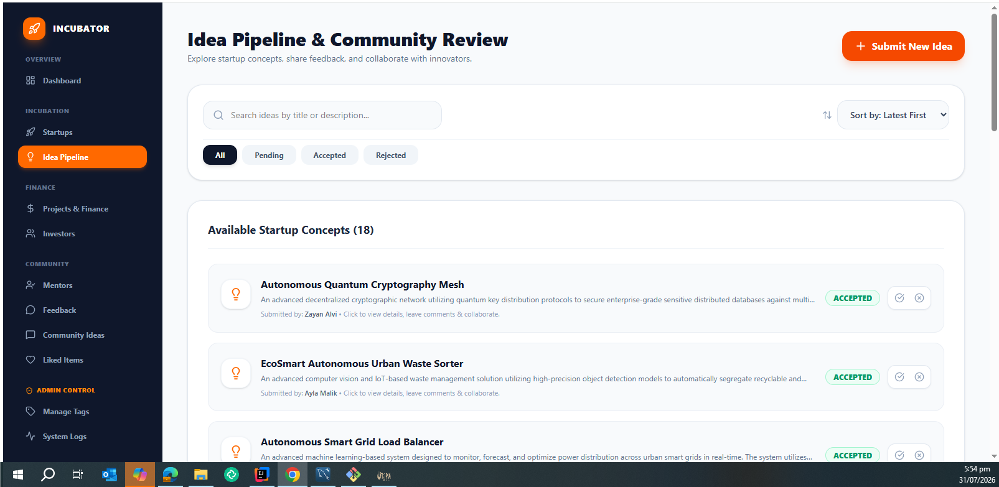 | 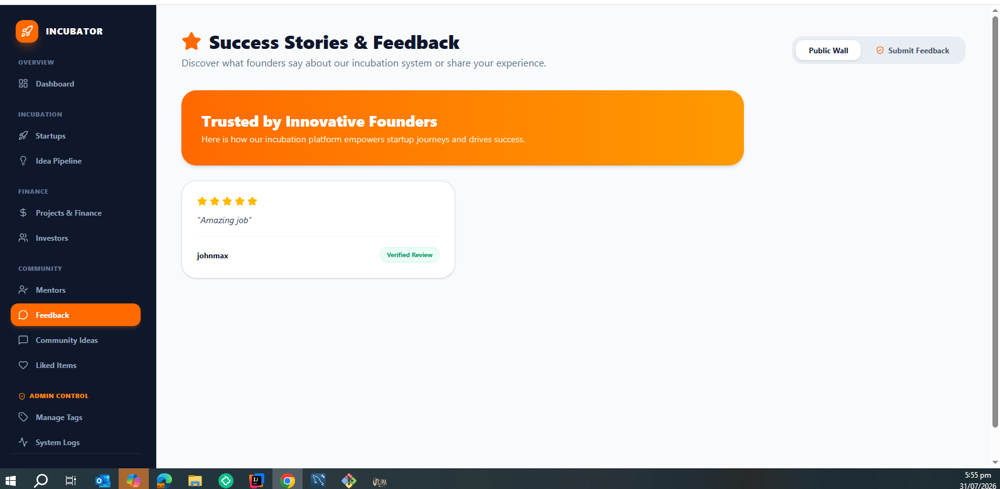 |

### Mentors & Investors Directory

| Mentors | Investors |
|---|---|
| 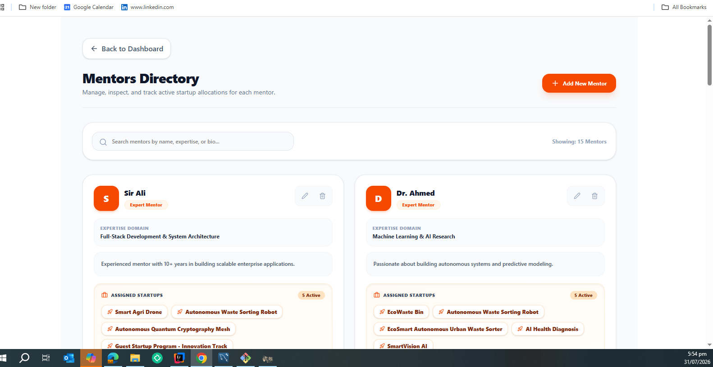 | 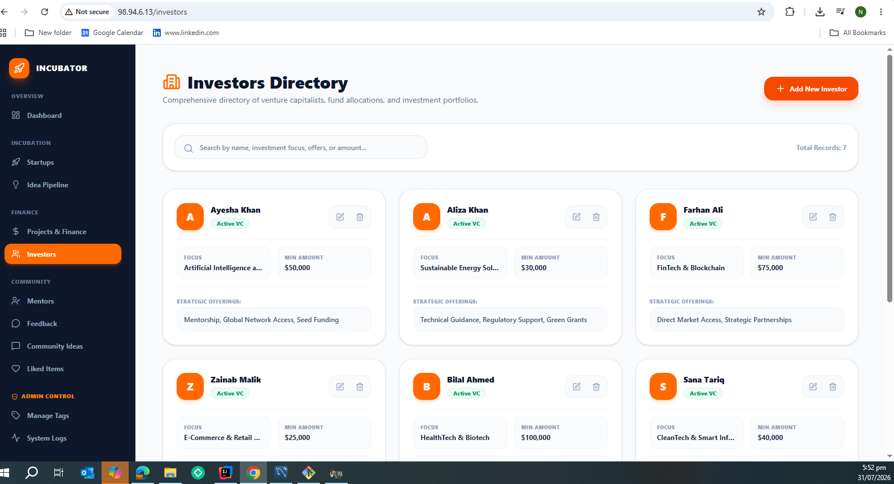 |

### Community, Finance & Notifications

| Community | Finance | Notifications |
|---|---|---|
| 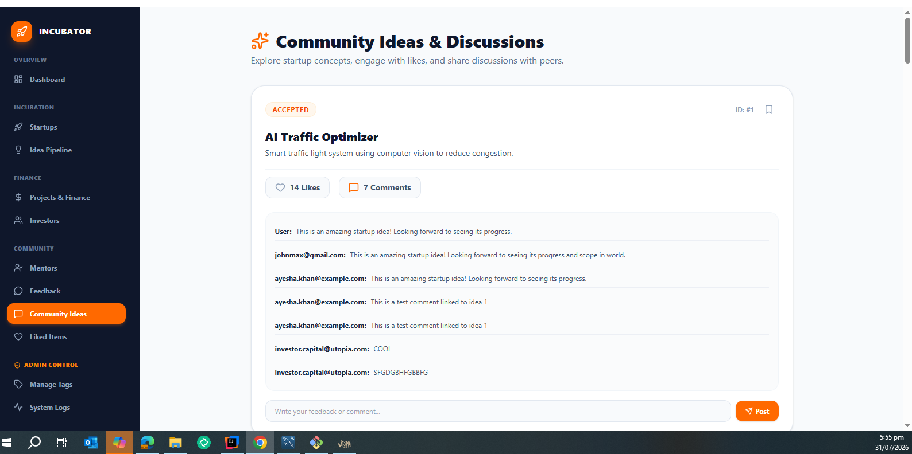 | 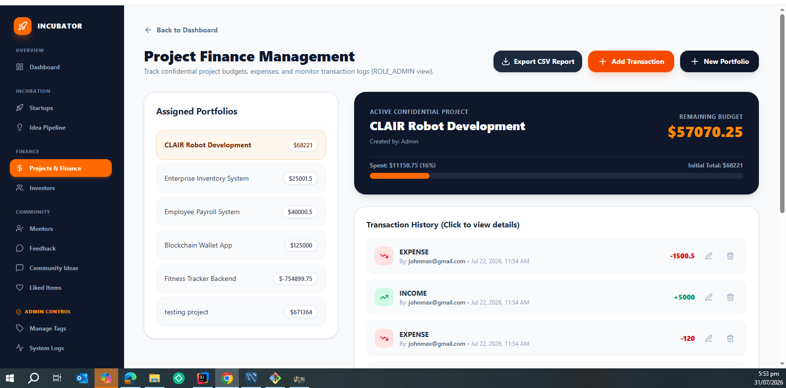 | 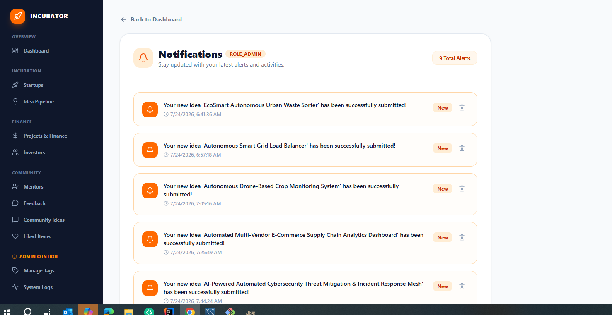 |

### Management & Activities

| Manage Tags | Activity / Comments | Additional Capture |
|---|---|---|
| 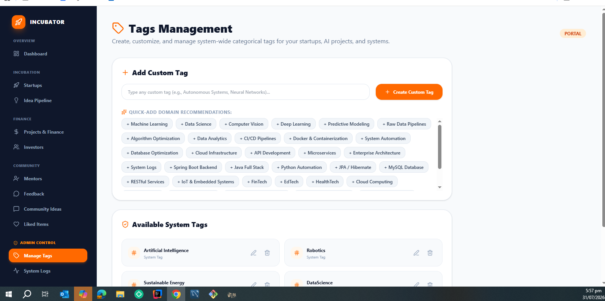 | 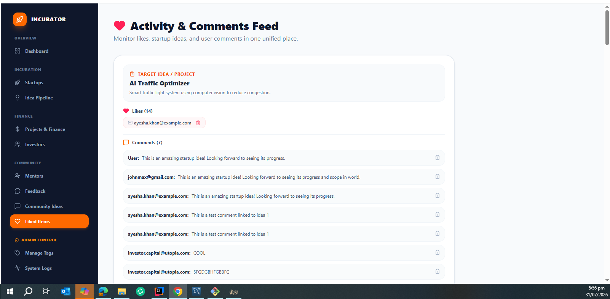 | 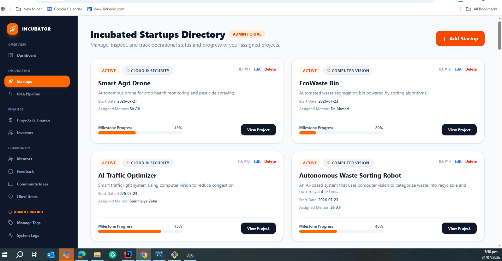 |